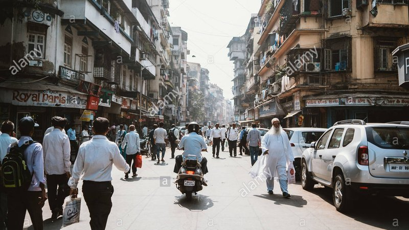
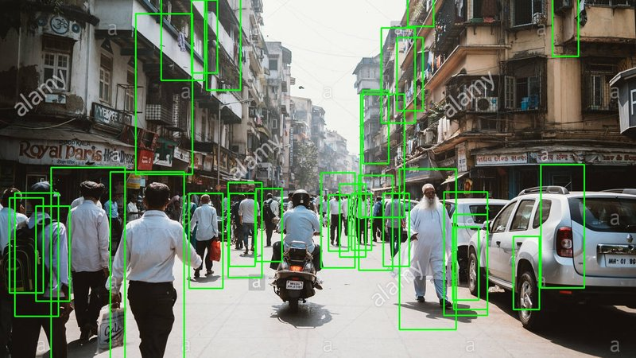

## A simple python script to detect pedestrians in an image using python's opencv

**[Github Link](https://github.com/akshaysin/pedestrian_detect)**

### Steps

* Install [openCV](https://docs.opencv.org/3.0-beta/doc/py_tutorials/py_setup/py_setup_in_windows/py_setup_in_windows.html)
* Place the image to be analyzed in root directory of the project. (In this case I use peds.jpg)
* Execute following comand from root of the directory : `python pedestrian.py peds.jpg`
* It takes a few seconds for it to run, you should following output if running against `peds.jpg` image.

      $ python pedestrian.py peds.jpg
      Found 31 pedestrian!
      Image written to file-system :  True
      [ INFO:0] Initialize OpenCL runtime...

* If all goes good, you should see a `peds_saved.jpeg` in the root directory. That is the analyzed image.

### Result

Here is a before and after snapshot of the image after the script was executed on the image.

### Actual Code

As can be seen below, it only takes a little over 30 lines in total to get this working. I am using openCV library for this task.

    import cv2
    import sys

    imagePath = sys.argv[1]
    cascPath = "haarcascade_pedestrian.xml"
    # cascPath = "pedestrian_another.xml"
    # cascPath = "haarcascade_fullbody.xml"

    pedsCascade =  cv2.CascadeClassifier(cascPath)

    # Read the image
    image = cv2.imread(imagePath)
    gray = cv2.cvtColor(image, cv2.COLOR_BGR2GRAY)

    # detect pedestrian in pic

    peds = pedsCascade.detectMultiScale(
            gray,
            scaleFactor=1.3,
            minNeighbors=9,
            minSize=(30, 30)
    )

    print("Found {0} pedestrian!".format(len(peds)))

    # Draw a rectangle around the peds
    for (x, y, w, h) in peds:
        cv2.rectangle(image, (x, y), (x+w, y+h), (0, 255, 0), 2)

    # cv2.imshow("Faces found", image)
    status = cv2.imwrite('peds_saved.jpg', image)
    print ("Image written to file-system : ",status)