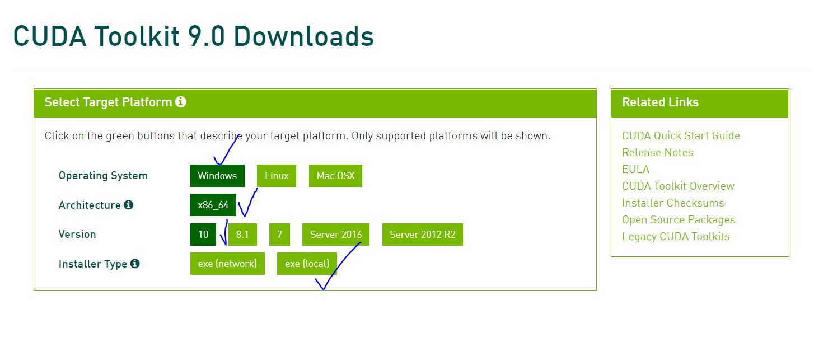
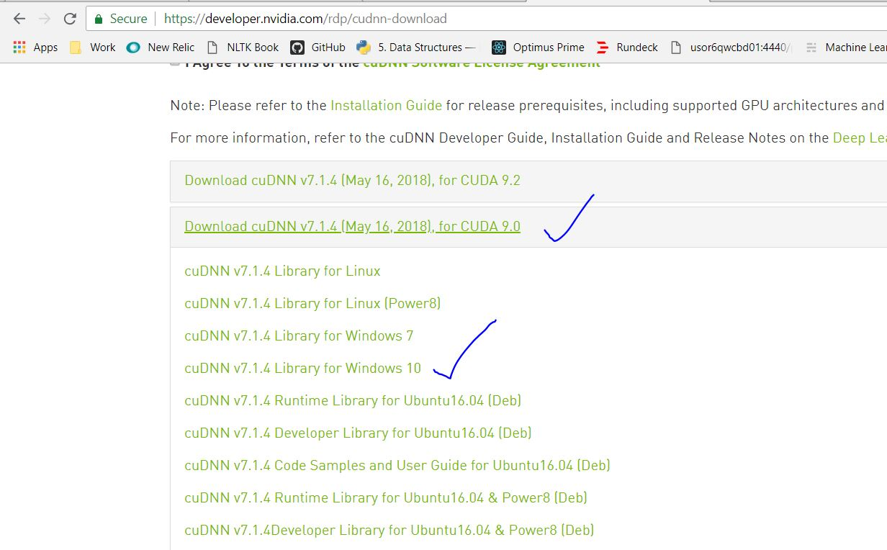

## Installing CUDA and cuDNN on windows 10

This is an how-to guide for someone who is trying to figure our, how to install CUDA and cuDNN on windows to be used with tensorflow.

**It should be noted that at the time of writing this, tensor flow is supporting only upto CUDA version 9.0 and corresponding cuDNN libraries so please don't download CUDA 9.2.**

### Installing CUDA 9.0 on windows.

Pre requisites :

* NVIDIA GPU with compute capability of > 2.0 . Check your GPU [here](https://developer.nvidia.com/cuda-gpus)
* Download [CUDA version 9.0](https://developer.nvidia.com/cuda-90-download-archive) 

Please note if your connection permits, please download the `local` version. That saves you from sitting around waiting for download to finish at the installation time. 

The download should be ~ 1.4 G. Once the download finishes, launch the installer and follow the defaults. It takes around 10-15 mins for installation to finish.
Pleasy verify the files at the default install location after the installation finishes: `C:\Program Files\NVIDIA GPU Computing Toolkit\CUDA\v9.0`

### Installing cuDNN from NVIDIA

First of all, register yourself at [NVIDIA Developer site](https://developer.nvidia.com/cudnn). Its an free registration and takes only a couple of mins. From there, the installation is a breeze
Once registered, goto the [download](https://developer.nvidia.com/rdp/cudnn-download) page and accept the terms and conditions. POst this download **cuDNN v7.1.4 for CUDA 9.0**

 
 Once the files are downloaded locally, unzip them. Installing cuDNN is pretty straight forward. You just have to copy three files from the unzipped directory to CUDA 9.0 install location. 
 For reference, NVIDIA team has put them in their own directory. So all you have to do is to copy file from :
 
 * `{unzipped dir}/bin/` --> `C:\Program Files\NVIDIA GPU Computing Toolkit\CUDA\v9.0\bin`
 * `{unzipped dir}/include/` --> `C:\Program Files\NVIDIA GPU Computing Toolkit\CUDA\v9.0\include`
 * `{unzipped dir}/lib/` --> `C:\Program Files\NVIDIA GPU Computing Toolkit\CUDA\v9.0\lib`

That's it.

### Testing it with tensor flow 

Install `tensorflow-gpu` using `pip3 install tensorflow-gpu`. Once that is done, fire up a python console do a `from tensorflow import *`. If you don't see any errors, we are good.

Another way you know that your GPU is being used by executing a keras model and having it use tensorflow as its backend. So at the runtime, you should see a message like this :

    2018-08-05 23:43:32.091733: I T:\src\github\tensorflow\tensorflow\core\platform\cpu_feature_guard.cc:141] Your CPU supports instructions that this TensorFlow binary was not compiled to use: AVX2
    2018-08-05 23:43:33.288310: I T:\src\github\tensorflow\tensorflow\core\common_runtime\gpu\gpu_device.cc:1392] Found device 0 with properties: 
    name: GeForce GTX 1050 Ti major: 6 minor: 1 memoryClockRate(GHz): 1.62
    pciBusID: 0000:01:00.0
    totalMemory: 4.00GiB freeMemory: 3.29GiB
    2018-08-05 23:43:33.289799: I T:\src\github\tensorflow\tensorflow\core\common_runtime\gpu\gpu_device.cc:1471] Adding visible gpu devices: 0
    2018-08-05 23:43:35.537890: I T:\src\github\tensorflow\tensorflow\core\common_runtime\gpu\gpu_device.cc:952] Device interconnect StreamExecutor with strength 1 edge matrix:
    2018-08-05 23:43:35.538772: I T:\src\github\tensorflow\tensorflow\core\common_runtime\gpu\gpu_device.cc:958]      0 
    2018-08-05 23:43:35.539309: I T:\src\github\tensorflow\tensorflow\core\common_runtime\gpu\gpu_device.cc:971] 0:   N 
    2018-08-05 23:43:35.540537: I T:\src\github\tensorflow\tensorflow\core\common_runtime\gpu\gpu_device.cc:1084] Created TensorFlow device (/job:localhost/replica:0/task:0/device:GPU:0 with 3020 MB memory) -> physical GPU (device: 0, name: GeForce GTX 1050 Ti, pci bus id: 0000:01:00.0, compute capability: 6.1)
 
 
 Happy coding