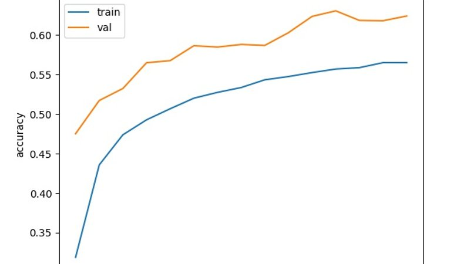
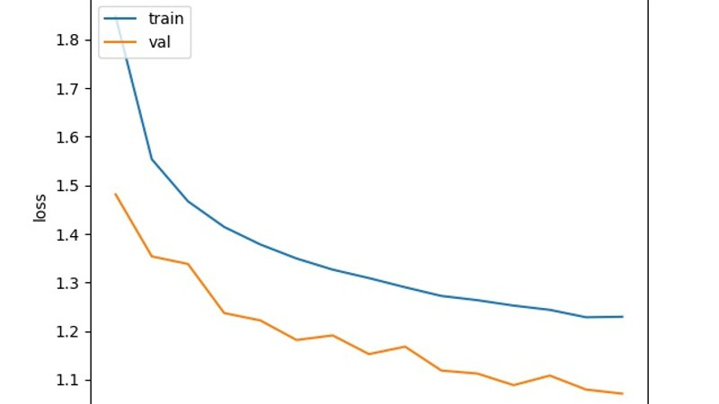

## Using Keras and CNN Model to classify CIFAR-10 dataset

### What is CIFAR-10 dataset ?

In their own words :

*The [CIFAR10](https://www.cs.toronto.edu/~kriz/cifar.html) dataset consists of 60000 32x32 colour images in 10 classes, with 6000 images per class. There are 50000 training images and 10000 test images.* 

*The dataset is divided into five training batches and one test batch, each with 10000 images. The test batch contains exactly 1000 randomly-selected images from each class. The training batches contain the remaining images in random order, but some training batches may contain more images from one class than another. Between them, the training batches contain exactly 5000 images from each class.*

This dataset has been made publicly available for machine learning research purposes. The best part is that it already comes classified.

### Prerequisites :

* Python 3.6
* [CIFAR-10 Dataset](https://www.cs.toronto.edu/~kriz/cifar.html) downloaded and extracted to your working directory
* CUDA 9.0 and cuDNN : Training a dataset like this, you would definitely wanna use that high end GPU of yours. Please refer to my [previous blog](https://akshaysin.github.io/installing-cuda.html) for more details on installing CUDA and cuDNN on windows.
* Keras 2 API

### On your marks, get set and go 

**Problem statement** : Try and classify CIFAR-10 dataset using Keras and CNN models. 

*Note : For anyone starting with image processing in machine learning, its highly advisable to try and attempt this first by their own. I am no way even mildly close to an expert in this field, but one thing that I learned so far is that, pre processing the data is probably the most important thing that we do in image processing, maybe next only to defining the models.*

#### Code
[Github link](https://github.com/akshaysin/keras_with_cifar10)

You can find all the related code from this exercise in github. Link above.

#### Pre processing the data 

The cifar10 data comes in 5 batches of train data and 1 batch of test data. Each of these have been "pickled" in python, so we would need to unpickle it.

    def unpickle(file):
        with open(file, 'rb') as fo:
            d = pickle.load(fo, encoding='bytes')
        return d
 
However we will also need a way to read the train and test date in an numpy array and paas it to our classifier. 

It becomes a little tricky given that our data is spread out between different files and using `np.vstack` is not advisable as that would be wasteful. Because every time you do a vstack, numpy would end up copying the whole array to a new location. Hence we use a little trick to first store the data in a list and then finally convert it to an numpy array

    def read_data(folder):
        x_data_temp = []
        y_data_temp = []
        x_test_data_temp = []
        y_test_data_temp = []
        # We don't use numpy's vstack here as that would be wasteful, because every time you do a vstack, numpy would end
        # up copying the whole array to a new location. Hence we use a little trick to first store the data in a list and
        # then convert it to an numpy array
    
        for file in os.listdir(folder):
            if file.endswith(".meta") or file.endswith(".html"):
                print("Ignoring html and meta files")
            elif "test_batch" in file:
                # test data file detected. we are gonna load it separately
                test_data_temp = unpickle(folder + "/" + file)
                x_test_data_temp.append(test_data_temp[b'data'])
                y_test_data_temp.append(test_data_temp[b'labels'])
            else:
                temp_data = unpickle(folder + "/" + file)
                x_data_temp.append(temp_data[b'data'])
                y_data_temp.append(temp_data[b'labels'])
        x_data = array(x_data_temp)
        y_data = array(y_data_temp)
        x_test_data = array(x_test_data_temp)
        y_test_data = array(y_test_data_temp)
        return [x_data, y_data, x_test_data, y_test_data]
        
From here, we can easily load the data. 

    X_train_temp, y_train_temp, X_test_temp, y_test_temp = read_data("cifar-10-batches-py")

However the work is not done yet. Since we converted from list to numpy array, there ia an extra dimension added to the array. for example, at this time :

    X_train_temp.shape = (6, 10000, 3072) and y_train_temp.shape = (6, 10000)

In order to fix this, we will need to reshape the stack.

    X_train_temp = X_train_temp.reshape(X_train_temp.shape[0] * X_train_temp.shape[1], X_train_temp.shape[2])
    y_train_temp = y_train_temp.reshape(y_train_temp.shape[0] * y_train_temp.shape[1])
    X_test_temp = X_test_temp.reshape(X_test_temp.shape[0] * X_test_temp.shape[1], X_test_temp.shape[2])
    y_test_temp = y_test_temp.reshape(y_test_temp.shape[0] * y_test_temp.shape[1])

Now lets shuffle the data a bit with random state 4

    X_train, y_train = shuffle(X_train_temp, y_train_temp, random_state=4)
    X_test, y_test = shuffle(X_test_temp, y_test_temp, random_state=4)
    
Finally, Splitting X and y in training and val data

    X_train, X_val, y_train, y_val = train_test_split(X_train, y_train, test_size=0.2, random_state=4)

Now that our data has been shuffled and spitted,  lets reshape it and get it ready to be fed into our CCN model

    # Keras Parameters
    batch_size = 32
    nb_classes = 10
    nb_epoch = 15
    img_rows, img_col = 32, 32
    img_channels = 3
    nb_filters = 32
    nb_pool = 2
    nb_conv = 3
    
    X_train = X_train.reshape(X_train.shape[0], 3, 32, 32)
    y_train = np_utils.to_categorical(y_train, nb_classes)
    
    X_val = X_val.reshape(X_val.shape[0], 3, 32, 32)
    y_val = np_utils.to_categorical(y_val, nb_classes)
    
    X_test = X_test.reshape(X_test.shape[0], 3, 32, 32)
    y_test = np_utils.to_categorical(y_test, nb_classes) 
    
Notice the `Keras Parameters` up there. We define them now but will use them with our model later.

Also lets regularize the data 

    X_train = X_train.astype('float32')
    X_val = X_val.astype('float32')
    X_test = X_test.astype('float32')
    
    X_train /= 255
    X_val /= 255
    X_test /= 255
    
With this we come to an end of prepossessing the CIFAR-10 data. Next we will look at CNN model for training.

#### Keras Model

I basically use three convolution larers and two fully connected layers. I played around with dropout in the CNN layers and found `.5` to be working better than `.25`. Here is the full code :

    model = Sequential()
    
    model.add(Conv2D(nb_filters, (nb_conv, nb_conv),
                     padding='valid',
                     activation='relu',
                     input_shape=(img_channels, img_rows, img_col),
                     data_format='channels_first',))
    
    model.add(Conv2D(nb_filters, (nb_conv, nb_conv), activation='relu'))
    model.add(MaxPooling2D(pool_size=(nb_pool, nb_pool)))
    model.add(Dropout(0.5))
    
    model.add(Conv2D(nb_filters, (nb_conv, nb_conv), activation='relu'))
    model.add(MaxPooling2D(pool_size=(nb_pool, nb_pool)))
    model.add(Dropout(0.5))
    
    model.add(Flatten())
    model.add(Dense(128, activation='relu'))
    model.add(Dropout(0.5))
    model.add(Dense(nb_classes, activation='softmax'))
    
    model.compile(loss='categorical_crossentropy',
                  optimizer='adam',
                  metrics=['accuracy'])
    
    history = model.fit(X_train, y_train, batch_size=batch_size, epochs=nb_epoch,
                        verbose=1, validation_data=(X_test, y_test))
                        
Since I only ran like 15 epochs, I only got a test accuracy of 62.42%. But you get the idea. 

    Test Score : 1.071166909980774
    Test accuracy:  0.6242
    
Here are the model accuracy and loss plots for the 15 epochs that I trained. 

**Model Accuracy**

**Model loss**

Happy coding :)