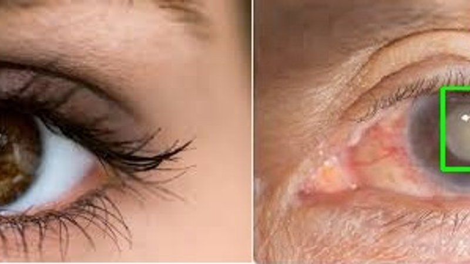
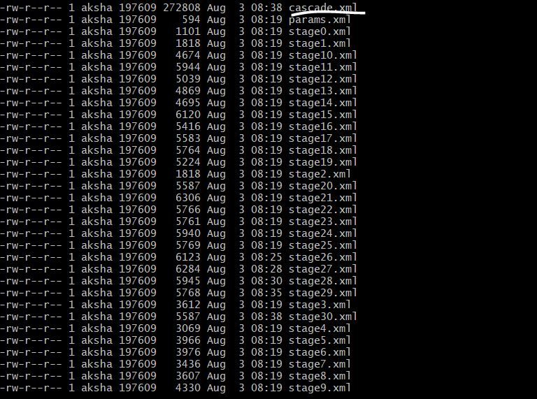
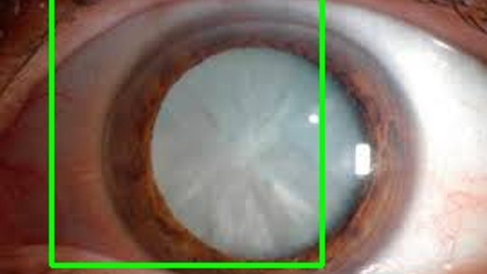

## Automated Cataract detection - Part 1 - Using OpenCV

This is gonna be a two part blog series describing a project of mine, that I was working on last few days, Automated Cataract detection using Machine Vision.

This thought occurred to me when I took my parents to eye doctors(separate times, of course :) ) and realized the sheer number of people that visit ophthalmologists every day. Now me coming from an relatively urban part of the country have ready access to doctors but I can imagine people in remote areas might not have such easy access. I wondered if we could write something using machine learning to automatically classify a cataract affected eye from an healthy eye and put it in an mobile app for common man to use.

So Something like this :

*Notice how it created a bounding box around the cataract when it detected one, but left the healthy eye unmarked*

With this in mind there were two ways I could have approached this problem,

* Using Python's OpenCV module
* Using CNN neural networks.

I tried both :). This first blog is gonna describe in detail the openCV approach and next blog will go over the Kera's approach. I am also releasing the source code with the hope that someone can take the good work further.

[Automated Cataract detection - Part 2 using CNN Models in Keras](https://akshaysin.github.io/cataract_detection_using_keras.html#.W21MYuhKhPY)

### Pre-requisites :

* [Image Augmenter](https://github.com/mdbloice/Augmentor)
* Python 3.6
* [OpenCV](https://opencv.org/)

### Installing dependencies 

    pip3 install opencv-python
    pip3 install Augmentor

### Pre processing the data 

Scavenging internet, I was only able to gather some 23 cataract affected eyes and 36 non affected eyes. Gathering data is always the most costliest affair of image processing. Please feel free to try this on your own data or data attached with this example.

When you have less data, its usually advisable to Augment the dataset. To this end, I came across a awesome tool [Image Augmenter](https://github.com/mdbloice/Augmentor). Using this I was able to create some 1400 positive and 1400 negative samples using those 23 and 36 images respectively. Its installation is listed under `Installation` section above.

Lets get started now. First create four folders `neg`, `info`, `input_path_neg` and `input_path_info` in root of your workspace. Next execute script `resize_clean_image.py` from the same directory. This does two things :

* Creates 1400 Samples each for negative and positive samples and puts them in `input_path_neg` and `input_path_info` folders.
* Resize's input images to 128 * 128 * 3  

Here is the relevant part of the code :

        def resize_img(im):
            resized_img = cv.resize(im, (128, 128))
            return resized_img
        
        
        # https://github.com/mdbloice/Augmentor
        def create_samples(dir):
            p = Augmentor.Pipeline(dir)
            # Point to a directory containing ground truth data.
            # Images with the same file names will be added as ground truth data
            # and augmented in parallel to the original data.
            # p.ground_truth("/path/to/ground_truth_images")
            # Add operations to the pipeline as normal:
            p.rotate(probability=1, max_left_rotation=5, max_right_rotation=5)
            p.flip_left_right(probability=0.5)
            p.zoom_random(probability=0.5, percentage_area=0.8)
            p.flip_top_bottom(probability=0.5)
            p.sample(1400)
        
        
        if __name__ == '__main__':
            dir_list = ['neg', 'info']
            dest = "input_path"
            # lets create a sample of 1000 negative and 1000 positive Images
            for img_dir in dir_list:
                print("************************Processing {0} Directory*****************************".format(img_dir))
                create_samples(img_dir)
                # Now lets move files created to input_path folder
                source = img_dir + "/output/"
                dest=dest+"_{0}".format(img_dir)
                files = os.listdir(source)
                for f in files:
                    shutil.move(source + f, dest)
                dest = "input_path"
                print("********************************************************************************")
        
            # # This loop will resize all imaes to 128*128*3
            # for img_dir in dir_list:
            #     # create_samples(img_dir)
            print("************************Starting the resize process*****************************".format(img_dir))
            for root, dirs, files in os.walk(dest):
                for file in files:
                    filefullpath = os.path.join(root, file)
                    if filefullpath.endswith('.jpg') or filefullpath.endswith('.JPG'):
                        im_read = cv.imread(filefullpath)
                        resized_img = resize_img(im_read)
                        print("[INFO] Writing converted {0} file".format(filefullpath))
                        cv.imwrite(filefullpath, resized_img)

Once the script is run successfully, simply rename `input_path_neg` and `input_path_info` to `neg` and `info`. Archive or delete the old dirs. 

### Creating manifest files for negative and positive samples :

OpenCV require's us to label positive and negative samples through a text file. So for negative samples, we would create a `bg.txt` and for positive samples we would create `info.lst`.

There's nothing really special about `bg.txt`. It only lists the name of all the negative sample files. 

As for `info.lst`, it catalogs the positive images along with a ROI, that you would want opencv to detect. Since these were eye images which usually would have a lot of other areas in addition to retina (cataract affected area), I find `1 0 0 100 100` as a good starting ROI.

Here is the script that recursively goes through `neg` and `info` folder and creates an `bg.txt` and `info.lst`. 

    def create_pos_n_neg():
        for file_type in ['neg', 'info']:
    
            for img in os.listdir(file_type):
    
                if file_type == 'info':
                    line = file_type + '/' + img + ' 1 0 0 100 100\n'
                    with open('info.dat', 'a') as f:
                        f.write(line)
                elif file_type == 'neg':
                    line = file_type + '/' + img + '\n'
                    with open('bg.txt', 'a') as f:
                        f.write(line)
    
    create_pos_n_neg()  
    
### Training the model

From here, its just a matter of training the OpenCV model and generating a haar cascade to use. Given below are the commands to do that

First create a empty directory `data` in your root

**Create a vectors file from info.lst**

    opencv_createsamples -info info.lst -num 1400 -w 20 -h 20 -vec positives.vec

Things to note, 

* Keep the number a little less than total number of samples
* Height and Width of 20 was optimum in my case. You can increase it but the training will take a lot longer.

**Train HAAR cascade**

Now we are ready to begin the training. Execute the below command 

    opencv_traincascade -data data -vec positives.vec -bg bg.txt -numPos 1300 -numNeg 650 -numStages 30 -w 20 -h 20

Things to note, 

* Keep the number of pos samples a little less than total number of samples in ur vector file.
* Keep the number of neg samples about half the number of pos samples you passed.
* Training time increases exponentially with number of stages. So choose accordingly.
* Keep width and height exactly the same as chosen in vector file.
* If you get an error saying `not enough samples`, decrease the num of pos and neg passed and try again.

Once done, you should see multiple xml files in your data directory, one for each stage and one `cascade.xml`. This is your trained model.

Now lets put this trained model to use and see if its any good. 

### Moment of truth.

Download an arbitrary true and false image of cataract from internet. Save them as `true_0.jpg` and `false_0.jpg`. Next using the `detect_cataract.py` script, execute following :

    $ python detect_cataract.py true_0.jpg
    Found 1 catarats!
    Image written to file-system :  True
    [ INFO:0] Initialize OpenCL runtime...

The script saves the result to a `cataract_saved.jpg` image in the same directory. Here is the result in this case

And here is the detect script

    imagePath = sys.argv[1]
    cascPath = "cascade.xml"
    
    pedsCascade =  cv2.CascadeClassifier(cascPath)
    
    # Read the image
    image = cv2.imread(imagePath)
    # resized_img = cv2.resize(image, (128, 128))
    gray = cv2.cvtColor(image, cv2.COLOR_BGR2GRAY)
    
    # detect coins in pic
    
    catarat = pedsCascade.detectMultiScale(
            gray,
            scaleFactor=1.3,
            minNeighbors=2,
            minSize=(50, 50)
    )
    
    print("Found {0} catarats!".format(len(catarat)))
    
    # Draw a rectangle around the peds
    for (x, y, w, h) in catarat:
        cv2.rectangle(image, (x, y), (x+w, y+h), (0, 255, 0), 2)
    
    # cv2.imshow("Faces found", image)
    status = cv2.imwrite('catarat_saved.jpg', image)
    print ("Image written to file-system : ",status)

### Credits 

* Special thanks to Harrison at this [blog](https://pythonprogramming.net/haar-cascade-object-detection-python-opencv-tutorial/). This is where I first learned about openCV and its usage. They also have really cool python tutorial videos in Youtube.
* Also special thanks to Satya Mallick at [learnopencv.com](https://www.learnopencv.com/). I have learned a lot from his blog posts about image processing. 

Happy Coding !!