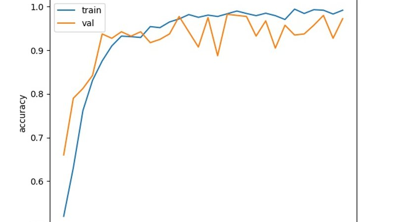
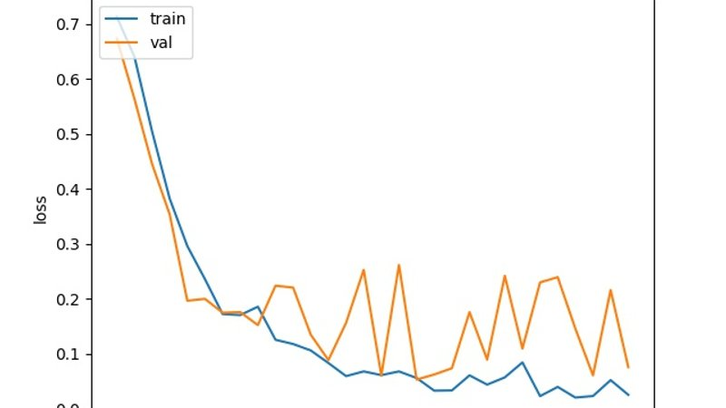

## Automated Cataract detection - Part 2 - Using Keras

This is part two of the blog series, Automated Cataract Detection. In first part we how how to use OpenCV to train a cascade which can somewhat differentiate between an healthy and an cataract affected eye. For part1, please refer to below link.

[Automated Cataract detection - Part 1 using OpenCV](https://akshaysin.github.io/cataract_detect.html#.W2xDw-hKhPY)

In this blog we will try to achieve the same same thing but using Convolution Neural Networks. We will implement these networks via python's keras 2 api. Lets get started !!

### Pre-requisites :

* [Image Augmenter](https://github.com/mdbloice/Augmentor)
* Python 3.6
* CUDA 9.0 and cuDNN : Training a model like this, you would definitely wanna use that high end GPU of yours. Please refer to my [previous blog](https://akshaysin.github.io/installing-cuda.html) for more details on installing CUDA and cuDNN on windows.
* Keras 2 API with Tensor Flow backend

### Installing dependencies 

    pip3 install tensorflow-gpu
    pip3 install Augmentor
    pip3 install scipy
    pip3 install keras
    
I am not going into the details of keras setup. Please refer to Keras [official site](https://keras.io/#installation) for that.

### Pre processing the data  - Augment and Resize

Scavenging internet, I was only able to gather some 23 cataract affected eyes and 36 non affected eyes. Gathering data is always the most costliest affair of image processing. Please feel free to try this on your own data or data attached with this example.

When you have less data, its usually advisable to Augment the dataset. To this end, I came across a awesome tool [Image Augmenter](https://github.com/mdbloice/Augmentor). Using this I was able to create some 1400 positive and 1400 negative samples using those 23 and 36 images respectively. Its installation is listed under `Installation` section above.

Lets get started now. First create four folders `neg`, `info`, and one `input_path` folder in root of your workspace. Next execute script `resize_clean_image.py` from the same directory. This does two things :

* Creates 1000 Samples each for images found in `neg` and `pos` folders and puts them in `input_path` folders.
* Resize's input images to 128 * 128 * 3  

Here is the relevant part of the code :

        def resize_img(im):
            resized_img = cv.resize(im, (128, 128))
            return resized_img
        
        
        # https://github.com/mdbloice/Augmentor
        def create_samples(dir):
            p = Augmentor.Pipeline(dir)
            # Point to a directory containing ground truth data.
            # Images with the same file names will be added as ground truth data
            # and augmented in parallel to the original data.
            # p.ground_truth("/path/to/ground_truth_images")
            # Add operations to the pipeline as normal:
            p.rotate(probability=1, max_left_rotation=5, max_right_rotation=5)
            p.flip_left_right(probability=0.5)
            p.zoom_random(probability=0.5, percentage_area=0.8)
            p.flip_top_bottom(probability=0.5)
            p.sample(1000)
        
        
        if __name__ == '__main__':
            dir_list = ['neg', 'pos']
            dest = "input_path"
            # lets create a sample of 500 negative and 500 positive Images
            for img_dir in dir_list:
                print("************************Processing {0} Directory*****************************".format(img_dir))
                create_samples(img_dir)
                # Now lets move files created to input_path folder
                source = img_dir + "/output/"
                files = os.listdir(source)
                for f in files:
                    shutil.move(source + f, dest)
                print("********************************************************************************")

Once the script is run successfully, you should find some 1400 images in `input_path` folder.

Once you have all the needed data in `input_path` folder, we are ready to read it all in numpy arrays now. These arrays will later be fed to our CNN models.

### Pre processing the data  - Reading them in numpy arrays

Read the data directory

    path = "input_path"
    listing = os.listdir(path)

Validate size of an random image is 128 * 128

    im_random = cv.imread("input_path//{0}".format(listing[23]))
    print(im_random.shape)

Next we will convert the image data into an imatrix. imatrix would just be a flat representation of each image's pixel data in each row. This imatrix is whats gonna be used to create X_train, X_validation and X_test data.

    imatrix = np.array([cv.imread("input_path//{0}".format(img)).flatten() for img in listing])
    # To validate, print the shape of the matrix
    print(imatrix.shape)
    print(type(imatrix))
    print(imatrix.ndim)
 
Now we will create labels array, y. Looking at `input_path` directory, we see that first 1000 images are positive images and next 1000 are negative. Based on this we will initialize our y array with `zeros` for first 1000 indexes and `ones` for next 1000.
 
    label = np.ones((count,), dtype=int)
    label[0:1001] = 0
    label[1001:2001] = 1
    size(label) 
    
Lets randomly shuffle the data to avoid over fitting
 
    data, label = shuffle(imatrix, label, random_state=2)
    train_data = [data, label]

Keras Training Parameters. Not much to talk about here except that we have only two `nb_classes` as we only wish to classify the data in two ways. Either the model detects cataract or it does not.
    
    # Keras Training Parameters
    batch_size = 32
    nb_classes = 2
    nb_epoch = 30
    img_rows, img_col = 128, 128
    img_channels = 3
    nb_filters = 32
    nb_pool = 2
    nb_conv = 3
    
Now splitting data between X_train, X_test, y_train, y_test, X_val and y_val

    (X, y) = (train_data[0], train_data[1])
    
    # Splitting X and y in training and test data
    X_train, X_test, y_train, y_test = train_test_split(X, y, test_size=0.2, random_state=4)
    
    # Splitting X_train and y_train in training and validation data
    # X_train, X_val, y_train, y_val = train_test_split(X_train, y_train, test_size=0.2, random_state=4)
    
    # Validating the individual sizes
    print("X_train : {0}".format(X_train.shape))
    print("y_train :{0}".format(y_train.shape))
    
    print("X_val : {0}".format(X_val.shape))
    print("y_val : {0}".format(y_val.shape))
    
    print("X_test : {0}".format(X_test.shape))
    print("y_test : {0}".format(y_test.shape))
    

Reshaping the data now

    # Reshaping the data to pass to CNN
    X_train = X_train.reshape(X_train.shape[0], 3, 128, 128)
    # X_val = X_val.reshape(X_val.shape[0], 3, 128, 128)
    X_test = X_test.reshape(X_test.shape[0], 3, 128, 128)
    
    y_train = np_utils.to_categorical(y_train, nb_classes)
    # y_val = np_utils.to_categorical(y_val, nb_classes)
    y_test = np_utils.to_categorical(y_test, nb_classes)
    
Regularize the data

    X_train = X_train.astype('float32')
    X_val = X_val.astype('float32')
    X_test = X_test.astype('float32')
    
    X_train /= 255
    X_val /= 255
    X_test /= 255
    
And that's it. We are now ready to define our model.

### Defining CNN model 

Let me quickly go over some noteworthy parts of this model. We are using here :

* Three Convolution Layers with `relu` activation function.
* Two fully connected layers with final activation function as `softmax`.
* Dropout of `.5` in three and `.25` in one layer.

        model = Sequential()
        
        model.add(Conv2D(nb_filters, (nb_conv, nb_conv),
                         padding="valid",
                         activation='relu',
                         input_shape=(img_channels, img_rows, img_col),
                         data_format='channels_first'))
        
        model.add(Conv2D(nb_filters, (nb_conv, nb_conv), activation='relu'))
        model.add(MaxPooling2D(pool_size=(nb_pool, nb_pool)))
        model.add(Dropout(0.50))
        
        model.add(Convolution2D(nb_filters, (nb_conv, nb_conv), activation='relu'))
        model.add(MaxPooling2D(pool_size=(nb_pool, nb_pool)))
        model.add(Dropout(0.25))
        
        model.add(Convolution2D(nb_filters, (nb_conv, nb_conv), activation='relu'))
        model.add(MaxPooling2D(pool_size=(nb_pool, nb_pool)))
        model.add(Dropout(0.50))
        
        model.add(Flatten())
        model.add(Dense(128, activation='relu'))
        model.add(Dropout(0.5))
        model.add(Dense(nb_classes, activation='softmax'))
        
        model.compile(loss='categorical_crossentropy',
                      optimizer='adam',
                      metrics=['accuracy'])

From here its a simple matter of training the model and plotting the accuracy and loss charts

Training 

    history = model.fit(X_train, y_train, batch_size=batch_size, epochs=nb_epoch,
                         verbose=1, validation_data=(X_test, y_test))

Results 

    loss: 0.0250 - acc: 0.9919 - val_loss: 0.0754 - val_acc: 0.9725
    
However looking at model accuracy and loss plots, we a huge variance in validation plot after about 8 epochs. What this points to is insufficient input data and over fitting. So we will need to fix that by providing better data to our model

### Plots 

### Testing the model trained by Keras on new image

So after the training, you have the option to save the trained model to disk. Given below is the code to save the model

    model_json = model.to_json()
    with open("model.json", "w") as json_file:
        json_file.write(model_json)
    # serialize weights to HDF5
    model.save_weights("model.h5")
    model.save("whole_model.h5")
    print("Saved model to disk")
    
After this you will have three new files in your root, `model.json`, `model.h5` and `whole_model.h5`. 

Next given below is an script to load the saved model above and use it to run prediction on an new image

    imagePath = sys.argv[1]
    
    model = load_model('whole_model.h5')
    
    model.compile(loss='categorical_crossentropy',
                  optimizer='adam',
                  metrics=['accuracy'])
    
    # Read the image
    
    img = cv2.imread(imagePath)
    img = cv2.resize(img,(128,128))
    img = np.reshape(img,[1,3,128,128])
    
    classes = model.predict_classes(img)
    
    print(classes)
    
    
That's it. If the model is trained right, it should be able to classify the input image as a `zero` or `one`. Where 

* A `zero` is `no cataract detected`. 
* A `one` would be `cataract detected`

Happy Coding !!