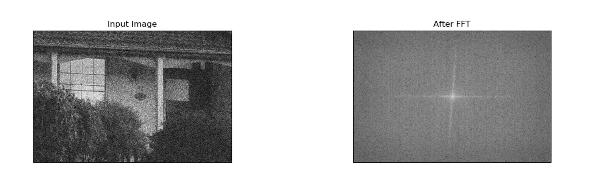
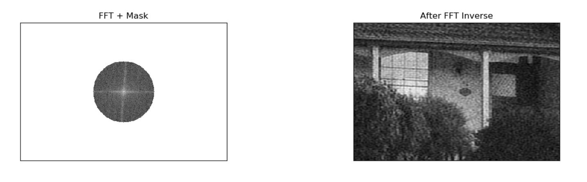
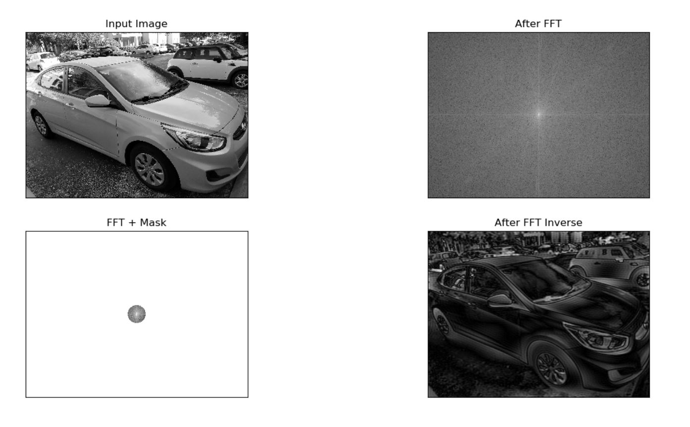
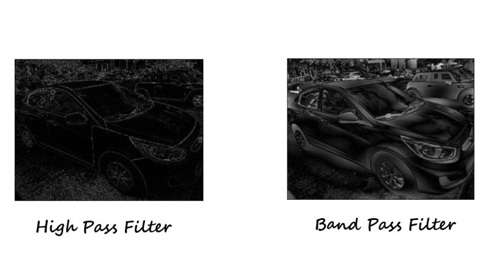

### Better Edge detection and Noise reduction in images using Fourier Transform 

This is the continuation of my previous blog where we learned, what is fourier transform and how application of high pass filter on fourier transform of an image can potentially help us with edge detection.
In case you missed it, please find it here :

[Edge detection in images using Fourier Transform ](https://akshaysin.github.io/fourier_transform.html#.W5njtOhKhPY)

In this post we are gonna learn about two other types of filters and see how can they help us in image analysis :

* Low pass filter
* Band pass filter

### Filters

I'll quickly go over the the concept of filters in the context of Fourier transform again. I am reproducing it as is from my last post here :

Filters in image processing are just what the name suggests, Filter. They are typically a mask array of the same size as the original image which when superimposed on the ordinal image, extracts only the attributes that we are interested in.

As mentioned earlier, in an FFT transformed image, low frequencies are found in the center and high frequencies are scattered around, we can then create a mask array which has a circle of zeros in the center and rest all ones. Now when this mask is applied to the original image, the resultant image would only have high frequencies. This becomes quite useful as low frequencies correspond to edges in spatial domain.

Although you can choose to use filters of many types, there are mainly three types of filter used:

* High Pass Filter (HPF)
* Low Pass Filter (LPF)
* Band Pass Filter (BPF)

Here's what a HPF looks like in python - Circular HPF mask, center circle is 0, remaining all ones

    # Circular HPF mask, center circle is 0, remaining all ones
    rows, cols = img.shape
    crow, ccol = int(rows / 2), int(cols / 2) 

    mask = np.ones((rows, cols, 2), np.uint8)
    r = 80
    center = [crow, ccol]
    x, y = np.ogrid[:rows, :cols]
    mask_area = (x - center[0]) ** 2 + (y - center[1]) ** 2 <= r*r
    mask[mask_area] = 0

LPF Filter - Circular LPF mask, center circle is 1, remaining all zeros

    # Circular LPF mask, center circle is 1, remaining all zeros
    rows, cols = img.shape
    crow, ccol = int(rows / 2), int(cols / 2) 

    mask = np.zeros((rows, cols, 2), np.uint8)
    r = 100
    center = [crow, ccol]
    x, y = np.ogrid[:rows, :cols]
    mask_area = (x - center[0]) ** 2 + (y - center[1]) ** 2 <= r*r
    mask[mask_area] = 1
    
Band Pass Filter - Concentric circle mask, only the points living in concentric circle are ones

    rows, cols = img.shape
    crow, ccol = int(rows / 2), int(cols / 2) 
    
    mask = np.zeros((rows, cols, 2), np.uint8)
    r_out = 80
    r_in = 10
    center = [crow, ccol]
    x, y = np.ogrid[:rows, :cols]
    mask_area = np.logical_and(((x - center[0]) ** 2 + (y - center[1]) ** 2 >= r_in ** 2),
                               ((x - center[0]) ** 2 + (y - center[1]) ** 2 <= r_out ** 2))
    mask[mask_area] = 1

Now in next section we shall look at applying the above filters to an image and see how it helps in noise filtering and better edge detection

### Noise Filtering in an image using Low Pass Filter (LPF)

Consider the following image and its fourier transform

As can be seen, the original image is quite noisy. We also notice a vertical and horizontal symmetry along the low frequency components in fourier transformed image. This is most probably due to sharp edges in the original pic.

As we learned earlier, the high frequencies depict a sudden change of image contrast from one pixel to another in spatial domain. That's why they correspond to edges in the spatial domain. 

Now extending that argument, you can think of little white dots on the original image, which constitute the noise, as minuscule edges too. After all they follow the same pattern too i.e sudden change of image contrast from one pixel to another in spatial domain. Now if we were to block majority of higf frequencies, theoretically, that should help in noise reduction.

Employing Low pass filter, we get following result :

   

As can be seen, we do see some reduced noise in the image but the lpf also took away some of the sharp feature of the image too. 

One key thing to note here is that, if the input image contains a lot of sharp edges, like walls, pillars, house etc (like in this case), application of LPF will eat away at those features too. So use it with discretion. 

Here is the python code 

    rows, cols = img.shape
    crow, ccol = int(rows / 2), int(cols / 2)  # center

    # Circular LPF mask, center circle is 1, remaining all zeros
    rows, cols = img.shape
    crow, ccol = int(rows / 2), int(cols / 2) 

    mask = np.zeros((rows, cols, 2), np.uint8)
    r = 70
    center = [crow, ccol]
    x, y = np.ogrid[:rows, :cols]
    mask_area = (x - center[0]) ** 2 + (y - center[1]) ** 2 <= r*r
    mask[mask_area] = 1
    
    # apply mask and inverse DFT
    fshift = dft_shift * mask

    fshift_mask_mag = 2000 * np.log(cv2.magnitude(fshift[:, :, 0], fshift[:, :, 1]))

    f_ishift = np.fft.ifftshift(fshift)
    img_back = cv2.idft(f_ishift)
    img_back = cv2.magnitude(img_back[:, :, 0], img_back[:, :, 1])
    
    plt.subplot(2, 2, 1), plt.imshow(img, cmap='gray')
    plt.title('Input Image'), plt.xticks([]), plt.yticks([])
    plt.subplot(2, 2, 2), plt.imshow(magnitude_spectrum, cmap='gray')
    plt.title('After FFT'), plt.xticks([]), plt.yticks([])
    plt.subplot(2, 2, 3), plt.imshow(fshift_mask_mag, cmap='gray')
    plt.title('FFT + Mask'), plt.xticks([]), plt.yticks([])
    plt.subplot(2, 2, 4), plt.imshow(img_back, cmap='gray')
    plt.title('After FFT Inverse'), plt.xticks([]), plt.yticks([])
    plt.show() 
    
    
    

### Better edge detection in an image using a Band Pass Filter

So far we've seen, a High pass filter and a Low Pass filter. We employed HPF for edge detection before. Details of which can be found in my previous post [Edge detection in images using Fourier Transform ](https://akshaysin.github.io/fourier_transform.html#.W5njtOhKhPY).

A Band pass filter is the combination of both HPF and LPF. It strives to achieve a balance in **not throwing away all of the low frequencies as well as all of the high frequencies**. Or in other words, it only allows a range of frequencies to pass. 

To visualize how would the NPF mask would look like, think of it as two concentric circle with the area between two circles as one's and rest all zero's. Something like this :

Now lets apply it to out old car image and see if it has any improvement over HPF

It does look better !!. THe edges are more prominent with BPF. Here is a side by side comparison 

Here is the python code for the same

    rows, cols = img.shape
    crow, ccol = int(rows / 2), int(cols / 2)  # center

    # Concentric BPF mask,with are between the two cerciles as one's, rest all zero's.
    rows, cols = img.shape
    crow, ccol = int(rows / 2), int(cols / 2) 

    mask = np.zeros((rows, cols, 2), np.uint8)
    r_out = 80
    r_in = 5
    center = [crow, ccol]
    x, y = np.ogrid[:rows, :cols]
    
    mask_area = np.logical_and(((x - center[0]) ** 2 + (y - center[1]) ** 2 >= r_in ** 2),
                               ((x - center[0]) ** 2 + (y - center[1]) ** 2 <= r_out ** 2))
    mask[mask_area] = 1
    
    # apply mask and inverse DFT
    fshift = dft_shift * mask

    fshift_mask_mag = 2000 * np.log(cv2.magnitude(fshift[:, :, 0], fshift[:, :, 1]))

    f_ishift = np.fft.ifftshift(fshift)
    img_back = cv2.idft(f_ishift)
    img_back = cv2.magnitude(img_back[:, :, 0], img_back[:, :, 1])
    
    plt.subplot(2, 2, 1), plt.imshow(img, cmap='gray')
    plt.title('Input Image'), plt.xticks([]), plt.yticks([])
    plt.subplot(2, 2, 2), plt.imshow(magnitude_spectrum, cmap='gray')
    plt.title('After FFT'), plt.xticks([]), plt.yticks([])
    plt.subplot(2, 2, 3), plt.imshow(fshift_mask_mag, cmap='gray')
    plt.title('FFT + Mask'), plt.xticks([]), plt.yticks([])
    plt.subplot(2, 2, 4), plt.imshow(img_back, cmap='gray')
    plt.title('After FFT Inverse'), plt.xticks([]), plt.yticks([])
    plt.show() 
    

Happy Coding !!