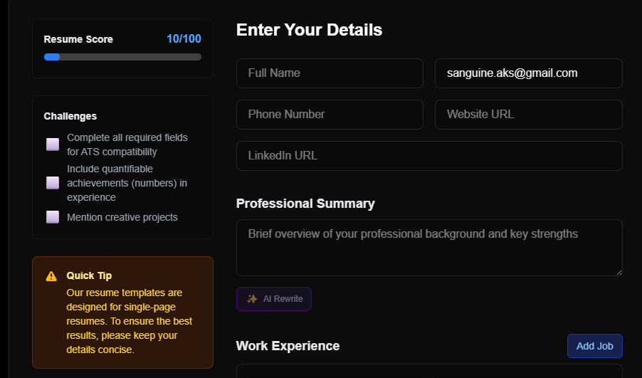

#### Announcing SecureCV: Your Privacy‑First, AI Powered Resume Builder

We’re excited to introduce [**SecureCV**](https://www.securecv.co.in/), a new open source tool designed to help you create professional resumes quickly, securely, and with zero hassle.

#### Why SecureCV?

- **No Account Needed:** Start building your resume instantly—no signups, no tracking.
- **AI Assistance:** Get smart suggestions to improve your resume content.
- **Customizable Templates:** Choose from multiple clean, modern layouts.
- **Privacy First:** Your data stays on your device; sessions are never stored.
- **Instant PDF Export:** Download your resume in print-ready PDF format.

#### How It Works

1. **Pick a Template:** Select a style that fits your personality and profession.
2. **Add Your Details:** Fill in your experience, skills, and summary.
3. **Get AI Suggestions:** Use built-in AI to polish your writing.
4. **Download as PDF:** Export your resume instantly—no watermarks, no paywalls.

#### Try It Now

Visit [https://www.securecv.co.in/](https://www.securecv.co.in/) and start building your resume in minutes.

---

**SecureCV is open source.** Fork it, contribute, or share your feedback to help us improve!

---
